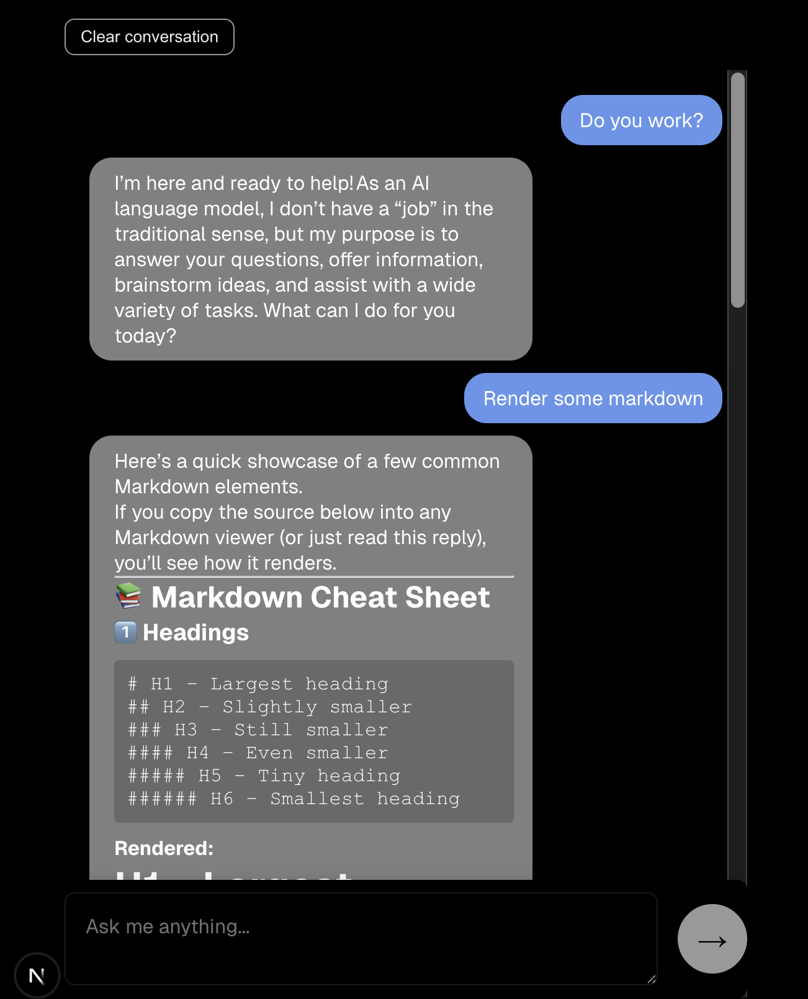

# FAKEGPT - MobiAI Software Test

Dummy AI chat interface that streams responses from the Ollama `gpt-oss:120b` model. 
Built with Next.js, React, and TypeScript.



## Features

- **Streaming responses** - Watch AI responses appear in real-time as they're generated
- **Persistent conversation history** - Chat history is saved to a local JSON database and survives page refreshes
- **Markdown rendering** - AI responses support Markdown with syntax highlighting for code blocks
- **Clear conversation** - Button to delete all history for the current session
- **Responsive design** - Works on desktop and mobile devices
- **Loading states** - Visual feedback with blinking ellipsis while waiting for responses
- **Input validation** - Send button is disabled when textarea is empty or AI is loading
- **Error checking** - Handles errors when reaching Ollama and displays 500s when appropiate

## Requirements

- Node.js 18+ and npm
- Ollama Credentials

## Setup & Installation

### 1. Create an ollama account

Create an account and sign in on to [ollama.ai](https://ollama.ai) to get an API Key
 https://ollama.com/settings/keys

 ### 2. Install and Sign in to ollama
 ```bash
 brew install ollama
ollama signin
```

### 3. Add the API key to access the model

The app uses Ollama's default configuration:
- Host: `https://ollama.com`
- API Key: Set via `OLLAMA_API_KEY` environment variable
- Model: `gpt-oss:120b`

Create a `.env.local` file on the root level of this repo and add the following:

```env
OLLAMA_API_KEY=your_api_key_here
```

or if you're feeling lazy just run directly in the terminal and source
```bash
export OLLAMA_API_KEY=your_api_key_here
```

### 4. Install dependencies

```bash
npm install
```

### 5. Start the dev server

```bash
npm run dev
```

The app will be available at `http://localhost:3000`

## How It Works

### Frontend (`src/app/page.tsx`)

- React component that manages chat state (messages, loading, session ID)
- Session ID is generated and stored in `localStorage` for conversation persistence
- Messages are streamed from the API and rendered progressively
- Uses `ReactMarkdown` with syntax highlighting for formatted output

### "Backend" "API" (`src/app/api/chat/route.ts`)

- Next.js API route that handles POST requests with user messages
- Persists conversation history to `conversation.json` in the project root
- Sends full conversation history to Ollama on each request (for context)
- Streams the model's response back to the user in real-time
- Supports DELETE requests to clear conversation history for a session

### Styling (`src/app/page.module.css`)

- CSS modules for scoped styling
- Fixed input container at the bottom of the viewport
- Message bubbles with left/right alignment based on sender role
- Fade in/out animation for loading indicator
- Mobile responsive

## Architecture

```
conversation.json (JSON file storage)
├── session-id-1: [Messages...]
├── session-id-2: [Messages...]
└── ...

Frontend (Next.js)
├── page.tsx (React Component)
├── page.module.css (Styles)
└── api/chat/route.ts (Streaming API endpoint)
```

## Conversation Persistence

Conversations are stored in `conversation.json` at the project root:

```json
{
  "abc-123-session-id": [
    { "role": "user", "content": "Plan a trip to Paris" },
    { "role": "assistant", "content": "I'd be happy to help..." }
  ]
}
```

## Decisions Made

- **File-based storage** - Simple JSON file for local persistence; easily swappable with a real database
- **localStorage for session IDs** - Keeps users on the same conversation thread across reloads
- **Markdown rendering** - Better readability for structured responses
- **CSS modules** - Scoped styling prevents conflicts
- **Streaming responses** - Better UX for long-running AI responses

## Future Improvements

- Multiple chat contexts in same session
- Switch to a real database (SQLite, PostgreSQL, GRAPHQL integration, etc) for production use
- Add user authentication and multi-user support
- Implement chat export/import functionality
- Add token usage tracking and cost estimation
- Support for different Ollama models via dropdown selector
- File upload support for documents
- UI Theme customizer

## Technologies Used

- **Next.js 16.1** - React framework with API routes
- **React 19** - UI library
- **TypeScript** - Type-safe development
- **Ollama SDK** - Local LLM integration (when trying to run travel model)
- **react-markdown** - Markdown rendering
- **remark-gfm** - GitHub-flavored Markdown support
- **rehype-highlight** - Syntax highlighting for code blocks
- **CSS Modules** - Component-scoped styling
- **ESLint** - Code linting
